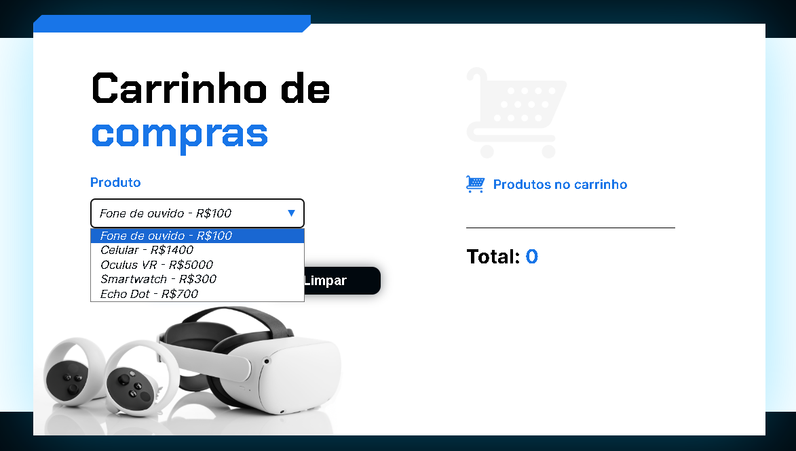
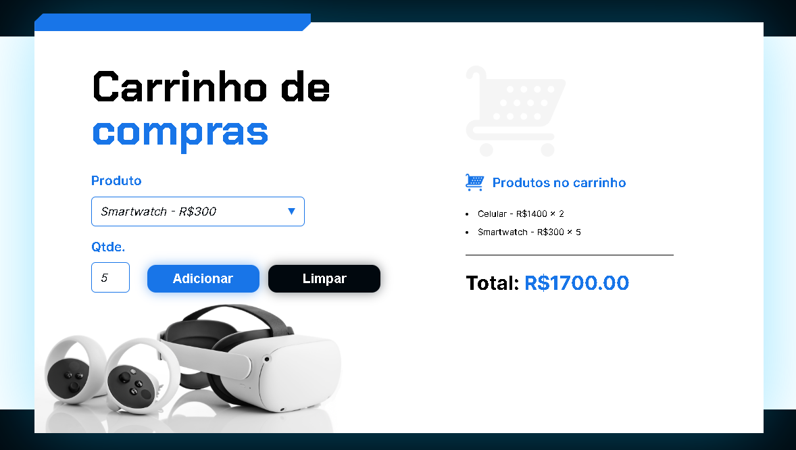

# Lista de Compras

## Descrição

Lista de Compras é um aplicativo web simples que permite que você crie e gerencie sua lista de compras.

## Funcionalidades

- Adicionar itens à lista de compras.
- Editar a quantidade de itens na lista.
- Remover itens da lista.
- Calcular o valor total da lista de compras.
- Limpar a lista de compras.

## Demonstração

Interface principal do aplicativo:

Tela de edição de um item:

## Tecnologias Utilizadas

- 
- 
- 
